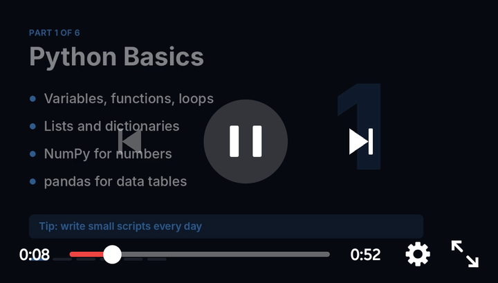
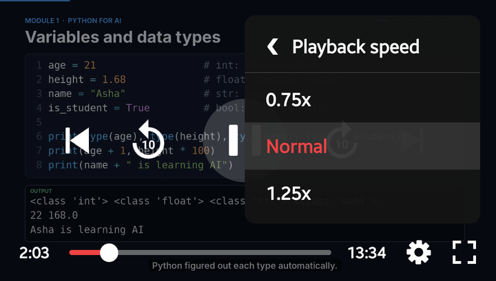
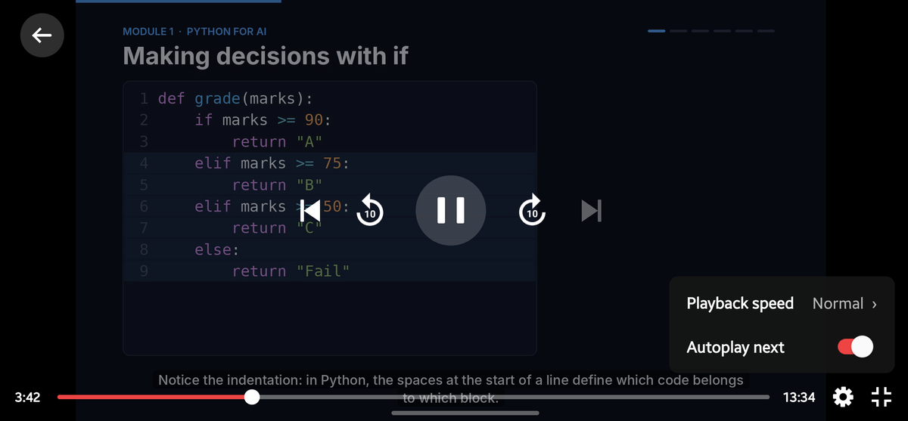

# react-native-all-video-player

One video player for React Native. Pass **any video URL**: YouTube links, mp4/mov/webm files, HLS (`.m3u8`) and DASH (`.mpd`) streams, signed stream links and S3/CDN files. Every source gets the same custom controls, settings menu and fullscreen.

| Controls | Settings |
|---|---|
|  |  |



## Features

- **Any source:** YouTube and video files or streams, through one component. Video files and streams play natively: ExoPlayer (Media3) on Android, AVPlayer on iOS.
- **Custom controls:** play/pause, double-tap left/right to seek, draggable seek bar and time.
- **Settings menu:** playback speed (0.25x to 2x) and, for playlists, an "Autoplay next" switch.
- **Playlists:** pass `playlist` with any mix of YouTube links and video files to get previous/next buttons and autoplay of the next video.
- **Thumbnails:** your own image, or a frame grabbed from the video, shown before the first play and at the end (and optionally while paused).
- **Built-in fullscreen:** rotates to landscape, hides the status bar, handles Android's back button, and restores everything on exit.
- **Picture in picture:** supported too.
- **One install:** nothing else to add, no AppDelegate/MainActivity changes.

## Installation

```sh
npm install react-native-all-video-player
cd ios && pod install
```

Rebuild the app afterwards (`npx react-native run-android` / `run-ios`). Requires the New Architecture and React Native 0.81+. Expo works with a development build (`npx expo prebuild`), not Expo Go.

On Android the player uses Media3 1.11.1. To use another version, set `media3Version` in your app's `android/build.gradle`:

```groovy
buildscript {
  ext {
    media3Version = "1.11.1"
  }
}
```

## Usage

```tsx
import { VideoPlayer } from 'react-native-all-video-player';

<VideoPlayer url="https://youtu.be/dQw4w9WgXcQ" style={{ width: '100%', aspectRatio: 16 / 9 }} />;
<VideoPlayer url="https://cdn.example.com/lessons/intro.mp4" style={{ width: '100%', aspectRatio: 16 / 9 }} />;
<VideoPlayer url="https://cdn.example.com/live/index.m3u8" style={{ width: '100%', aspectRatio: 16 / 9 }} />;
```

Give the player a size; 16:9 suits most videos. Pass `url` or `playlist`; TypeScript reports an error if both are missing.

### Playlists

```tsx
<VideoPlayer
  playlist={[
    'https://youtu.be/dQw4w9WgXcQ',
    'https://cdn.example.com/lessons/intro.mp4',
    'https://cdn.example.com/lessons/part-2.m3u8',
  ]}
  playlistStartIndex={1}
  onVideoChange={(index, url) => console.log('now playing', index, url)}
  style={{ width: '100%', aspectRatio: 16 / 9 }}
/>;
```

- Previous/next buttons appear beside play/pause; each is dimmed at the start or end of the list. Pressing one starts that video.
- With "Autoplay next" on (the default), the next video starts when one ends, inline or in fullscreen.
- A playlist with one video behaves like a plain `url`.

### Thumbnails

```tsx
<VideoPlayer url="https://cdn.example.com/a.mp4" thumbnail="https://cdn.example.com/a.jpg" thumbnailOnPause />;
```

The thumbnail covers the video before the first play and at the end, and while paused if `thumbnailOnPause` is set. Without `thumbnail`, video files (mp4, mov, webm, …) use a frame grabbed from the video, skipping blank frames; HLS/DASH streams get none.

### Supported sources

| Source | Android | iOS |
|---|---|---|
| YouTube id or link (watch, youtu.be, shorts, embed, live) | ✓ | ✓ |
| MP4 / MOV | ✓ | ✓ |
| WebM / MKV | ✓ | — |
| HLS (`.m3u8`) | ✓ | ✓ |
| DASH (`.mpd`) | ✓ | — |

- On Android, streams are recognised by their `.m3u8` / `.mpd` extension; links without one play as regular files. iOS also detects HLS from the server's response.
- Seeking needs a server that supports HTTP range requests.
- Plain `http://` URLs need cleartext traffic allowed on Android and an App Transport Security exception on iOS.
- Playback pauses when the app goes to the background, unless picture in picture takes over.
- On iOS, playing a video file sets the app's audio session to playback, so sound plays even with the silent switch on.

### Controlling it from code

```tsx
const player = useRef<VideoPlayerRef>(null);

<VideoPlayer ref={player} url="https://cdn.example.com/a.mp4" onEnd={() => console.log('done')} />;

player.current?.seekTo(90);
player.current?.play();
```

### Fullscreen

The fullscreen button (or `ref.setFullscreen(true)`) opens the player in a full-screen Modal, rotated to landscape, continuing from the same position. Back, or the button again, returns to the inline player. The screen goes back to its previous orientation, so a portrait-only app stays portrait-only. Entering fullscreen starts a second player, so a spinner shows briefly.

See [`example/App.tsx`](example/App.tsx) for a runnable screen.

## Props

| Prop | Type | Default | |
|---|---|---|---|
| `url` | `string` | — | Any video URL, or a YouTube id/link. Required unless `playlist` is given. |
| `playlist` | `string[]` | — | Videos to play in order, YouTube and files mixed; used instead of `url`. Adds previous/next buttons and "Autoplay next" in settings. |
| `playlistStartIndex` | `number` | `0` | Playlists: the video to start with. |
| `onVideoChange` | `(index: number, url: string) => void` | — | Playlists: the player moved to another video (previous/next or autoplay). |
| `autoPlay` | `boolean` | `false` | Play as soon as the player is ready. |
| `startSeconds` | `number` | `0` | Start position. |
| `thumbnail` | `string` | — | Image URL shown before the first play and at the end, for any source. See [Thumbnails](#thumbnails). |
| `thumbnailOnPause` | `boolean` | `false` | Also show the thumbnail while paused mid-video. |
| `hideYouTubeBranding` | `boolean` | `false` | YouTube only: show the video's own thumbnail before the first play and at the end. |
| `showControls` | `boolean` | `true` | `false` gives a bare player you drive through the ref. |
| `playbackRates` | `number[]` | `[0.25, 0.5, 0.75, 1, 1.25, 1.5, 1.75, 2]` | Speeds under Settings → Playback speed; `[]` removes that row (and the settings button, unless it's a playlist). |
| `seekStepSeconds` | `number` | `10` | Seconds each double-tap seeks; `0` turns double-tap seeking off. |
| `doubleTapToSeek` | `boolean` | `true` | Double-tap left or right of the center controls to seek back / forward. The areas start just past the previous/next buttons in a playlist, otherwise just past play/pause. |
| `accentColor` | `string` | `#EF4444` | Seek bar, selected speed and switch color. |
| `allowFullscreen` | `boolean` | `true` | Show the fullscreen button. |
| `onFullscreenChange` | `(fullscreen: boolean) => void` | — | |
| `style` | `ViewStyle` | — | Size and position. |
| `renderLoading` | `() => ReactNode` | spinner | Shown while loading/buffering. |
| `renderBackButton` | `({ exitFullscreen }) => ReactNode` | arrow in a circle | Replaces the fullscreen back button (shown with the controls). Position it yourself; return `null` to hide it. |
| `onReady` | `({ duration }) => void` | — | `duration` is `0` for live streams. |
| `onStateChange` | `(state: PlayerState) => void` | — | `Unstarted / Ended / Playing / Paused / Buffering / Cued`. |
| `onProgress` | `({ currentTime, duration }) => void` | — | About twice a second. |
| `onEnd` | `() => void` | — | |
| `onError` | `({ code?, message }) => void` | — | See [Errors](#errors). |

## Ref

| Method | |
|---|---|
| `play()` / `pause()` | |
| `seekTo(seconds)` | Clamped to the video length. |
| `setPlaybackRate(rate)` | |
| `mute()` / `unMute()` | |
| `getCurrentTime()` / `getDuration()` | Last reported values, in seconds. |
| `setFullscreen(on)` | Enter or leave fullscreen. |

## Types

```ts
import {
  PlayerState,
  type PlayerError,
  type ProgressEvent,
  type VideoPlayerProps,
  type VideoPlayerOptions,
  type VideoSource,
  type VideoPlayerRef,
} from 'react-native-all-video-player';
```

`VideoPlayerProps` is `VideoSource` (`url` or `playlist`) plus `VideoPlayerOptions` (everything else).

`PlayerState` has the values `Unstarted` (-1), `Ended` (0), `Playing` (1), `Paused` (2), `Buffering` (3) and `Cued` (5). They're the same for every source.

## Helpers

```ts
import { resolveSource, youtubeId, isValidVideoId, formatTime } from 'react-native-all-video-player';

resolveSource('https://youtu.be/dQw4w9WgXcQ');  // { kind: 'youtube', videoId: 'dQw4w9WgXcQ' }
resolveSource('https://cdn.example.com/a.mp4'); // { kind: 'video', url: 'https://cdn.example.com/a.mp4' }
resolveSource('not a url');                     // null
formatTime(3725);                               // '1:02:05'
```

## Errors

Video files and streams report a `message` and no `code`. On Android the message is one of "A network error stopped the video from loading", "The video link is invalid or has expired" or "The video format is not supported", falling back to the player's own message. On iOS it is the system's error description. A `url` that is neither a YouTube video nor an http(s) URL reports "Not a YouTube link or a video URL".

YouTube videos report a `code`:

| `code` | Meaning |
|---|---|
| `2` | Invalid video id. |
| `5` | Can't be played in an HTML5 player. |
| `100` | Not found, removed, or private. |
| `101`, `150`, `152` | The owner disabled embedding. |
| `153` | YouTube rejected the player configuration. |
| none | The player failed to load (e.g. offline). |

## Development

```sh
npm install
npm test
npm run typecheck
npm run build
```

## License

MIT
